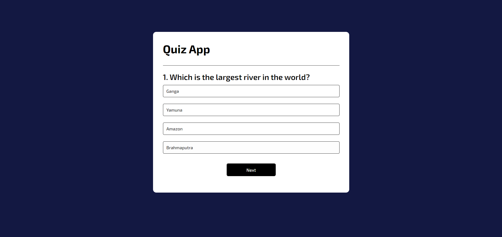

# Quiz App

A simple quiz application that allows users to answer multiple-choice questions and receive feedback on their answers.



## Table of Contents

- [Features](#features)
- [Technologies Used](#technologies-used)
- [Setup](#setup)
- [Usage](#usage)
- [Code Explanation](#code-explanation)
- [HTML](#html)
- [CSS](#css)
- [JavaScript](#javascript)

## Features

- Displays multiple-choice questions.
- Provides feedback on the correctness of the selected answer.
- Shows the next question upon clicking the "Next" button.
- Restarts the quiz after the last question.

## Technologies Used

- HTML
- CSS
- JavaScript

## Setup

1. Clone the repository.
   ```sh
   git clone https://github.com/adityadhiman-in/Quiz_App
   ```
2. Navigate to the project directory.
   ```sh
   cd quiz-app
   ```
3. Open `index.html` in your preferred web browser.

## Usage

- Answer the questions by clicking on one of the provided options.
- Click the "Next" button to proceed to the next
- Click the "Next" button to proceed to the next question.
- After the last question, click the "Restart" button to restart the quiz.
